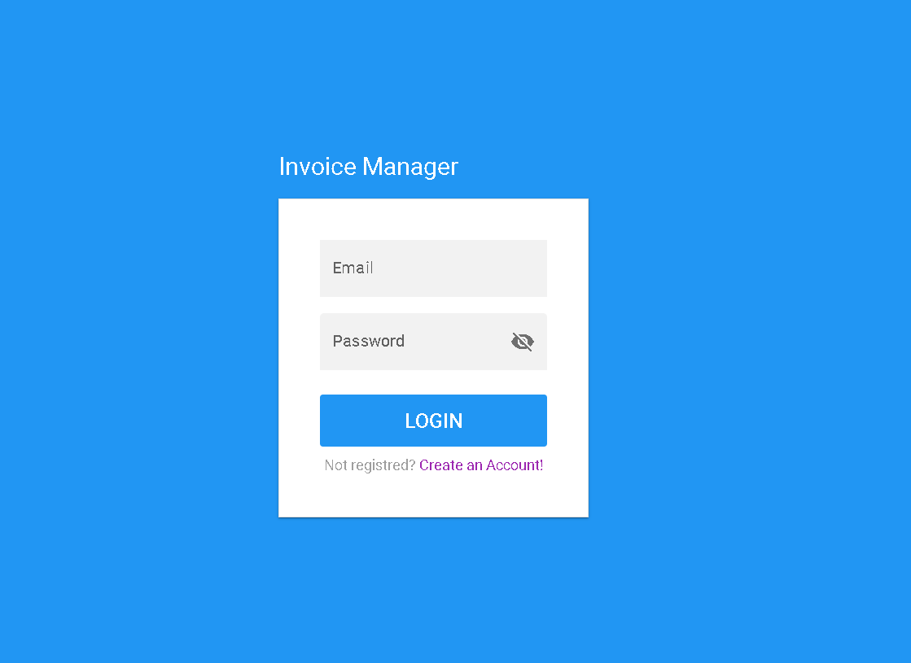
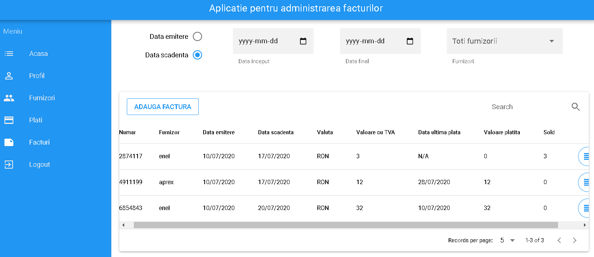
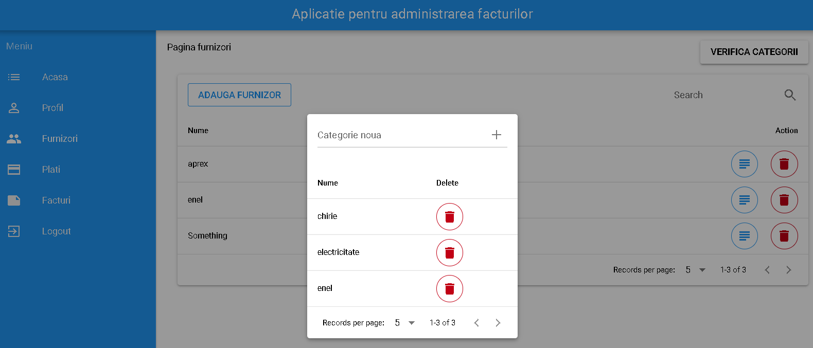

# Invoices management app


[TOC]

## Introducere

Invoices managanagement app este o aplicatie pentru a ajuta la gestionarea facturilor de zi cu zi pentru o persoana fizica sau juridica. Pentru dezvoltare s-au folosit tehnologiile VueJS[[1]](#1), NodeJs[[3]](#3), Quasar[[2]](#2), Sequelize[[5]](#5), PostgreSQL[[6]](#6), PassportJs[[4]](####4).

## Descriere problema

Folosind un numar tot mai mare de servicii si produse, achizita acestora devine necesara si tot mai greu de gestionat o parte importanta in acest proces, mai exact evidenta platilor acestora. Un meniu in care clientul sa poata vedea la ce are de plata, cat a platit pana acum, cat mai are de platit , conturi din si catre are de platit si alte detalii ce corespund acestui proces.

## Descriere API

Prin intermediul API-ului clientul poate sa isi stocheze furnizorii existenti, sa ii vizualieze, modifice sau sa ii stearga. Pentru acestia se pot efectua operatii CRUD si pentru facturi, iar pe langa acestea sa ataseze o plata la o anumita factura, partiala sau completa.

## Flux de date

### Exemple de request/response


```json
// Exemplu Register
// POST: {{url}}/api/auth/register

// Request body
{
	"firstName":"George",
	"lastName":"Vasile",
	"email":"george.vasile@stud.ase.ro",
	"password":"asd"
}

// Response body
{
    "message": "User George Vasile was created"
}
```


```json
// Exemplu adaugare furnizor
// POST: {{url}}/api/suppliers

// Request body
{
    "name": "Something",
    "CUI": "0000000000",
    "ORC": "11111111111",
    "phone": "072016568",
    "email": "aaaaa@aaa.com",
    "fax": "1111-1111",
    "categoryId": "2"
}

// Response body
{
    "message": "Supplier Something was added."
}
```


### Metode HTTP

| Verb HTTP | Cale                      | Descriere                                                |
| --------- | ------------------------- | -------------------------------------------------------- |
| GET       | /api/reset                | reseteaza baza de date                                   |
| POST      | /api/auth/register        | adauga un nou utilizator al aplicatiei                   |
| POST      | /api/auth/login           | autentifica utilizator existent                          |
| GET       | /api/auth/logout          | dezautentifica utilizator autentificat                   |
| POST      | /api/suppliers/categories | adauga categorie noua                                    |
| GET       | /api/suppliers/categories | reda toate categoriile existente                         |
| GET       | /api/suppliers/           | reda furnizorii existenti                                |
| ADD       | /api/suppliers            | adauga furnizor nou                                      |
| DELETE    | /api/suppliers            | sterge furnizor exitent                                  |
| PUT       | /api/suppliers            | modifica furnizor exitent                                |
| GET       | /api/invoices             | reda facturile existente pentru utlizatorul autentificat |
| POST      | /api/invoices             | adauga factura noua                                      |
| POST      | /api/invoices/payment     | efectueaza o plata pentru o factura existenta            |
| DELETE    | /api/invoices             | sterge o factura                                         |
| GET       | /api/invoices/all         | reda facturile pentru toti utilizatorii                  |


### Autentificare si autorizare servicii

Pentru autentificare am folosit Passport.js [[4]](#4), avand o strategie simpla prin permitand accesul prin username si parola. 

Singurele endpoint-uri ce pot fi folosite fara ca utilizatorul sa fie autentificat sunt **register** si **login**, pentru restul fiind necesar ca utilizator sa fie autentificat. Iar pentru a reda toate facturile si a reseta baza de date, e nevoie ca utlizatorul sa fie de tip **Admin**.

## Capturi ecran aplicatie

- Pagina de autentificare



- Pagina pentru administrarea facturilor



- Pagina pentru administrarea furnizorilor



## Referinte

| #    | Nume       | Link                       |
| ---- | ---------- | -------------------------- |
| 1    | VueJS      | https://vuejs.org          |
| 2    | Quasar     | https://quasar.dev         |
| 3    | NodeJs     | https://nodejs.org/en/     |
| 4    | PassportJs | http://www.passportjs.org  |
| 5    | Sequelize  | https://sequelize.org      |
| 6    | PostgreSQL | https://www.postgresql.org |

